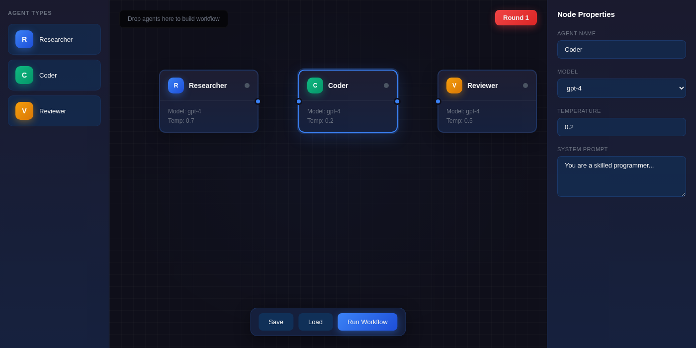
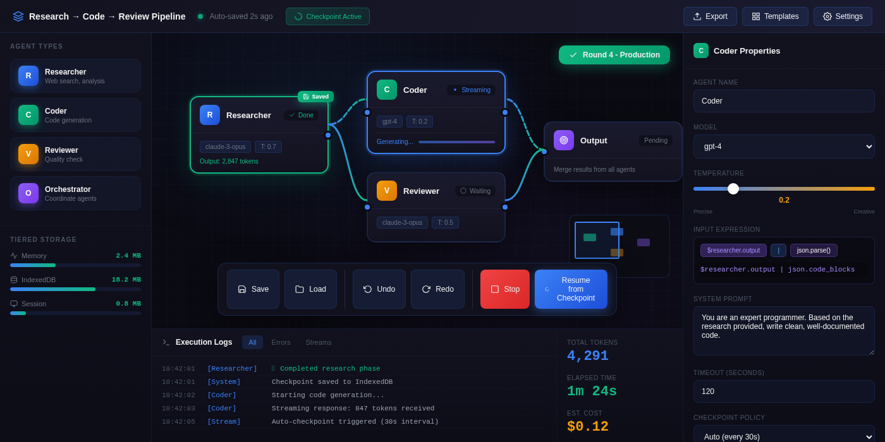

# Plan with Debate

A Claude Code plugin that uses multi-turn planning to create high-quality implementation designs through iterative agent collaboration.

## How It Works

Two AI agents iteratively refine a design until they reach consensus:

- **Architect**: Creates and improves the design
- **Reviewer**: Critically analyzes and proposes enhancements

Each agent produces complete, improved designs. The process continues until both agents agree the design is optimal.

```
┌─────────────────────────────────────────────────────────────┐
│  Round 1                                                    │
│  ┌─────────────┐         ┌─────────────┐                   │
│  │  Architect  │────────▶│  Reviewer   │                   │
│  │  (Design)   │         │  (Improve)  │                   │
│  └─────────────┘         └─────────────┘                   │
│         │                       │                           │
│         ▼                       ▼                           │
│  Round 2, 3, ... until consensus                           │
│         │                       │                           │
│         └───────────┬───────────┘                          │
│                     ▼                                       │
│            ┌───────────────┐                               │
│            │ Final Design  │                               │
│            └───────────────┘                               │
└─────────────────────────────────────────────────────────────┘
```

## Why This Works: Real Example

**Task**: "Design a visual AI agent workflow builder"

| Round | What Changed |
|-------|--------------|
| 1 | Basic React Flow canvas, simple Zustand state, Web Workers |
| 2 | Added execution orchestration layer, streaming support |
| 3 | Checkpoint manager, tiered storage, expression system |
| 4 | **Stream resurrection** - survives page refresh! |

**Time**: 26 minutes → **Result**: Production-ready 2,600 line design

### Visual Comparison: Round 1 vs Round 4

**Round 1** - Basic workflow builder with simple nodes and properties:



**Round 4** - Production UI with tiered storage, execution logs, checkpoints, and expression system:



<details>
<summary>Architecture Evolution (Text)</summary>

**Round 1** - Basic setup:
```
React App → Canvas → Zustand → Web Workers → IndexedDB
```

**Round 4** - Production architecture:
```
┌─────────────────────────────────────────────────────────────────┐
│  Canvas (React Flow) │ Properties Panel │ Toolbar & Palette    │
├─────────────────────────────────────────────────────────────────┤
│           State Management (Zustand + Immer + persistence)      │
├─────────────────────────────────────────────────────────────────┤
│  Adaptive Executor │ Resilient Stream Manager │ Checkpoint Mgr  │
├─────────────────────────────────────────────────────────────────┤
│  Composable Expressions │ Tiered Storage │ Append-Only Log     │
└─────────────────────────────────────────────────────────────────┘
```

</details>

**What the iteration caught**:
- ❌ Page refresh loses all execution state
- ✅ Checkpoint-based stream resurrection (auto-recovers after refresh)
- ✅ Three-tier storage (Memory → IndexedDB → SessionStorage)
- ✅ Composable expression system for complex data flows
- ✅ Shared Worker pool with resource quotas

## When to Use This

**Good for:**
- Tasks with multiple valid approaches
- Security/performance/architecture trade-offs
- Ambiguous requirements needing exploration
- Changes affecting multiple components

**Skip for:**
- Single obvious solution
- Trivial changes (typos, formatting)
- Well-established patterns

## Installation

### Option 1: Add as Marketplace (Recommended)

```bash
# Add the marketplace
/plugin marketplace add michaelvll/plan-with-agents

# Install the plugin
/plugin install plan-with-agents
```

### Option 2: Direct Clone

```bash
git clone https://github.com/michaelvll/plan-with-agents ~/.claude/plugins/plan-with-agents
```

Then restart Claude Code.

## Usage

### Basic Usage

```bash
/plan-with-agents "Design API caching layer"
```

Or simply run without a task to be prompted:

```bash
/plan-with-agents
```

### Examples

```bash
# Standard planning (most cases)
/plan-with-agents "Design REST API for user profiles with rate limiting"

# Quick consensus for simpler tasks
/plan-with-agents --max-rounds 5 "Add rate limiting middleware"

# Deep exploration for complex/critical tasks
/plan-with-agents --model opus --max-rounds 12 "Design payment processing system"

# Resume an interrupted session
/plan-with-agents --resume latest
```

## CLI Options

| Flag | Description | Default |
|------|-------------|---------|
| `--max-rounds N` | Maximum planning rounds | 8 |
| `--model MODEL` | Model: sonnet, opus, haiku | sonnet |
| `--timeout SECS` | Timeout per API call | 300 |
| `--resume latest` | Resume interrupted session | - |
| `--implement` | Auto-implement after consensus | - |
| `--verbose` | Show full agent outputs | - |
| `--no-color` | Disable colored output | - |
| `--self-test` | Run diagnostics | - |
| `--list` | List available sessions | - |

## Configuration

### Config File

Create `.debate.json` in your project root or home directory:

```json
{
  "maxRounds": 8,
  "model": "sonnet",
  "timeout": 300,
  "verbose": false
}
```

### Environment Variables

```bash
export DEBATE_MAX_ROUNDS=8
export DEBATE_MODEL=sonnet
export DEBATE_TIMEOUT=300
export NO_COLOR=1  # Disable colors
```

### Precedence

Configuration is resolved in this order (later overrides earlier):
1. Defaults
2. Config file (`.debate.json`)
3. Environment variables
4. CLI flags

## Output

Results are saved to `debate_output/session_*/`:

```
debate_output/session_20260116_123456/
├── final_design.md       # The agreed-upon design (read this first)
├── debate_history.md     # Full conversation transcript
├── session.json          # Metadata
└── session_state.json    # State for resumption
```

## Examples Directory

See `examples/` for curated planning sessions:

- `api-design/` - REST API design with rate limiting
- `auth-flow/` - JWT authentication with refresh tokens
- `database-schema/` - E-commerce schema with indexing

Each example includes:
- `task.txt` - Original task description
- `final_design.md` - Consensus design
- `NOTES.md` - Curator annotations on key decisions

## Troubleshooting

### Run Self-Test

```bash
./debate --self-test
```

This checks:
- Claude CLI installation
- Output directory permissions
- Disk space
- Python version

### Interrupted Sessions

Sessions are automatically saved when interrupted (Ctrl+C). Resume with:

```bash
/plan-with-agents --resume latest
```

### Low Similarity Scores

If agents show low similarity (< 30%) after several rounds:
- Task may be too vague - add specific constraints
- Task may be too complex - break into smaller pieces
- Agents may be exploring significantly different approaches

## Requirements

- Claude Code CLI (2.0+)
- Python 3.8+

## License

MIT

## Contributing

Contributions welcome! Please see the [CHANGELOG](CHANGELOG.md) for recent changes.
